# END-USER/EXPERT BOT SOLUTION
The end user/expert bot solution is a 2 bot product that allows the end users to query a knowledge base using natural language.
If no answer is found on the Knowledge base or if the user thinks that the answer is wrong, a team of experts is contacted using the second bot of the solution.

The expert bot allows the team of experts to answer to the end users' questions and to update and improve the knowledge base. All this interaction is also done through the usage of natural language.

This soultion allows for several end user and expert channels, however currently only has been tested for the following:

* End User:
	* Skype
	* Web Chat

* Expert:
	* Microsoft Teams

# ARCHITECTURE AND DATA MODEL
The full solution comprises of the following items:
* End User Bot
* Expert Bot
* Knowledge Base
* Table storage
* Natural Language Understanding service
* Queue
* Event Hub
* Stream Analytics

## Tables
There are several No-SQL tables supporting the solution. Their main purpose is:

* Storing user data;
* Store the mappings between users and the questions they made;
* Store the questions that need be answered by the experts;
* Store the End user feedback regarding the response from the Knowledge base;
* Store Auditing logs for further processing by BI tools
* Store the bot context and state.

### Users
The users table stores information about the End Users of the system, namely the user id, the channel, the last time the user was active and if the user has the notifications turned on.

The Users table is partitioned by ChannelId and each row is identified by the UserId. (The pair ChannelId/UserId is always unique)

When the End User bot receives a new message, he either creates or updates a record for the user, setting the last active time to the time the message was received. When creating a user, the notifications are always enabled.

### Still Interested Table
The still interested table is used to store the mapping between the users and the questions they make.
This table contains the questions, the user, the channel and whether the answer was already given or not. (This flag is used to decide if the message coming from the experts is an update to the answer or the first time the answer is given).

The table is partitioned by the Question scentence and each row is identified by \{channelId:userId\}.

Whenever a new message arrives from the "Experts to User" queue, the bot retrieves all the users that are interested on the question (retrieves that question's partition). 

### Unanswered Questions Table
The unanswered questions table is used to store which questions are pending an answer from the Experts. The table contains the question, the answer that was given from the Knowledge Base (if it exists), the question that matched on the Knowledge base (if it exists) and the date the question was posted to the experts.
There is no need to store the user information since it will be stored on the still interested table.

The table is partitioned using the hash of the question and each row identifier is calculated as the hash of the question that matched on the knowledge base. This ensures that there are no duplicates of the same question.

Whenever a new message arrives to the Expert Bot, a new record for that question is inserted on the table.

### Expert Bot Channels
The expert bot channels table stores a list of all the channels that are available for the Expert bot. This allows the bot to broadcast a question from a user to a multitude of Expert teams and individual contributers (through inividual channels such as skype).

This table is partitioned by the bot framework channelId and contains for each channel a unique identifier (guid) and the JSON serialization of a bot framework's ConversationReference object.

Everytime a message is sent to the Expert Bot, the bot checks if the channel is already registered. If it's a new channel, a new record is created

### Feedback table
The feedback table holds the information about the user feedback for a given pair question/answer. This feedback can be either negative (no answer was found or the answer was deemed wrong) or positive (the answer given by the Knowledge base was correct).

The table is partition by Positive and Negative feedbacks, and the key inside each partition is given by a unique id (GUID) that is generated for every question. The table also stores the answer given by the knowledge base, if it existed.

### Auditing
The auditing tables are used to store data that then will be used to produce reports of the usage of the solution.

There are 2 auditing tables:

* ExpertAuditing - stores all the auditing information for the expert bot;
* EndUserAuditing - stores all the auditing information for the end user bot;

### Bot Data
The bot data tables are the tables that are used by the bot framework to mainitain the Bot context and state.

There are bot data tables on this solution, one for each bot. Each one of them is a no-SQL table on Azure Table Storage. For more details on these tables check [this link](https://docs.microsoft.com/en-us/bot-framework/dotnet/bot-builder-dotnet-state-azure-table-storage).

The tables are:

* **enduserbotdata** - stores the bot data for the End User bot;
* **expertbotdata** - stores the bot data for the Expert bot;

## Queues
This solution uses Azure Storage queues to ensure both bots can exchange messages without being tightly coupled. Since the messages are small in size and there are no needs of storing them for a long time the Service Bus Queue was not taken into account.

There are 3 queues in total in this solution:

* User to Expert queue
* Expert to User queue
* Notifications queue

### User to Expert Queue
The user to expert queue is implemented as an Azure Storage Queue.

The object that is sent in the queue has the following fields:
* **Question** - the question of the user;
* **OriginalAnswer** - the answer that was given by the Knowledge Base (if exists);
* **OriginalQuestion** - the question from the Knowledge Base that matched the user's question (if exists).
* **ExpertAnswer** - the answer of the expert (it will be blank);
* **Timestamp** - when the question was posted;
* **MessageType** - If the message is about a Wrong Answer from the Knowledge Base or if is about a question that has no answer.

### Expert to User Queue
The expert to user queue is also implemented as an Azure Storage Queue.
The object that is sent in the queue has the same structure as the object sent on the User to Expert Queue. The ExpertAnswer field will be filled this time.

### Notifications queue
The notifications queue is also implemented as an Azure Storage Queue.
The object that is sent in the queue only has one field:
* TextToSend

## Blobs
There are 2 blob containers on the solution:

* Configurations
* Files

These containers were implmented on Azure Blob Storage

### Configurations
The configurations container contains the configuration files for both bots.

As stated before, for each bot, there are 2 files - the configuration file and the message file. Hence the configurations container has the following contents:

* End User Bot Configuration;
* End User Bot Messages;
* Expert Bot Configuration;
* Expert Bot Messages;

### Files
The files container is where the files that can be downloaded by the users are stored.
Currently there will only be 2 files on this container:

* Private Knowledge Base file
* Public Knowledge Base file

## KNOWLEDGE BASE
The Knowledge Base is the core element of the solution. The knowledge base is a set of question/answer pairs with what both bots interact.

Currently the knowledge base is implemented using the Microsoft QnA Maker. This product has a Question/Answer list and has a small component of NLU, that ensures that an exact match with the question on the knowledge base is needed.

## EVENT HUBS
The event hubs are a tool that allows the processment of several events at the same time. On this solution, the Event Hub is used to send auditing events from both bots.

To ensure that the data is logically separated, there are 2 event hubs, one for the EndUser events and other for the Expert events.

## STREAM ANALYTICS
The Stream Analytics component is responsible for reading the events from the event hub and place them in the respective table (ExpertAuditing or EndUserAuditing).

To do so, the stream analytics job gets the data from each one of the event hubs and place it on the respective Azure table.

# END USER BOT
The end user bot is a bot designed to work on several channels, namely Skype and Web Chat, that allows the end user to query a knowledge base for information. If the user doesn't find the information that he uas looking for, or if the information is not correct, he has the ability to notify a team of experts to insert the correct answer on the knowledge base.
The bot uses an NLU engine to determine what are the intents of the end user. Currently, the bot has available the following intents:
* AskQuestion -- The user wants to query the knowledge base and notify the experts team if the answer is missing or is wrongly given;
* DownloadKnowledgeBase -- The user wants a file with all the knowledge base. In the end user bot the file only contains the list of questions stored on the knowledge base. The file is in a tsv (tab separated values) format;
* TurnOnNotifications -- The user wants to receive notifications about updates on the answer of his questions.
* TurnOffNotifications -- The user wants to stop receiving notifications about updates on the answer of his questions.

## EVENT FLOWS
### AskQuestion flow of events
The AskQuestion flow of events is the following:

1. User writes on the Skype window (eg. What is Azure Stack?);
2. The bot understands that the intent is AskQuestion and fowards the query to the Knowledge Base;
3. If the knowledge base didn't find the answer, a message is automatically posted to the Experts team and a record for this question/user pair is stored in table storage. 
	1. If otherwise, the answer is shown to the user.
		1. The user is enquired if the answer given by the knowledge base is correct
		2. If the answer is correct, that feedback is stored and nothing more is done.
		3. If the answer is incorrect, the query is posted to the Experts teams and a record for this question/user pair is stored in table storage.

4. ...
5. When an answer to that question arrives, the bot gets all the users that are pending an answer to that question and notifies them of the answer.
6. If further updates happen to the answer, only the users that have the notifications turned on will receive them.

Note: If a question has more that a given number of "Correct" feedback than the answer is always considered correct.

### Download Knowledge Base flow of events
The Download Knowledge Base flow of events is the following:
1. User writes on the Skype window (eg. I want to download the knowledge base);
2. A link to the blob containing the file is posted by the bot. This link has an expiration time, after which it stops to work.

The file only contains a __list of the questions__ that are present on the knowledge base.

### Notification flow of events
The Notification flow of events is the following:
1. User writes on the Skype window (eg. I want to turn off/on my notifications);
2. The notifications are set to on or off depending on the choice of the user.

## AUDITING
Currently the following events are being logged on Event Hub for auditing:

* New question asked;
* Download of Knowledge Base;
* Technical Errors.

## JOBS
There are several jobs that are ran periodically on the end user side of the solution:
 * the Expert to User Queue listener job;
 * the Notifications Queue listener job;
 * the Still Interested job;

### Expert to User Queue Listener
The Expert to User  queue listner is job that listens to the Expert to User Queue. The job periodically polls the queue for new answers given by the experts. The poll interval is set to 10 seconds and it's currently not configurable.

Whenever a new message arrives, the job check which users are expecting the answer that came in the message and posts the answer to each one of these users. Users that have the notifications turned on, won't get any updates on the answers.

### Notifications Queue Listener
The notifications queue listner is job that listens to the Notification Queue. The job periodically polls the queue for new notifications. The poll interval can be configured using the _NotificationPollInterval_ key. The value is set in **minutes**.

Whenever a new message arrives, it is sent to all users that have interacted with bot.

### Still Interested Job
This job monitors the table of questions that were made by the users. It is used to ask the End User if he/she is still interested on a question that they made in the past and has yet to get an answer.

There are 2 parameters on this job:

* How frequently the job checks which questions are pending an answer; This is configurable using the key _stillInterestedPollIntervalHours_. The value is set in **hours**
* How many days without an answer before the user is questioned if he/she is still interested. This is configurable using the setting _stillInterestedTimeoutDays_. The value is set in **days**.

If the users says he/she is still interested on the question, the question is resubmited to the expert team and the number of days without an answer is reset to 0. If the user is not interested on the question, he/she won't get notified if an answer arrives.

# EXPERT BOT

## EVENT FLOWS
### New Question event flow
Whenever a new message arrives the bot will inform the experts of that event.

When the question doen't have any answer from the knowledge base, the bot posts an informational notification on each available channel stating which question has been asked.

However, if the end user thought the answer the he received from the knowledge base was wrong, then the bot will go through the following steps:

1. Checks if the question that matched on the knowledge base is the same as the one the user made.
2. If the questions match, then the user is prompt to select wheater the original answer is correct or if he wants to replace it with a new one; If they don't match, then the expert can also create a specific Q/A pair with a new answer.
3. If the user selects to replace the existing answer or to create a specific pair, he will be prompted for the answer to be stored;
4. The answer is stored (or maintained if the user opted to keep the original answer), the question is removed from the UnansweredQuestions table and the End Users are notified of the answer.

### Answer question event flow
The answer question event flow enables the expert to answer to any question he wants regardless of having being previously asked by an end user.

This flow allows the expert to add new entires to the knowledge base, to update answers that are already on the knowledge base or to answer questions from end users that are pending an answer.

The answer question event flow is the following:

1. The expert write the intention on Teams (eg. I want to answer the question What is Azure Stack?)
2. The bot will try to find a question on the utterance. If no question is found than it shows the list of pending questions and follows the List Unanswered questions flow detailed later
3. The bot will ask for the answer for that question;
4. After the bot receives the answer it will check if there is already a match for that question on the knowledge base and will do one of the following things:

	1. If no match is found, then a new record is created on the knowledge base;
	2. If a match is found for that same question the user is prompt to chose if he wants to keep the original answer or overwrite that record with the new answer;
	3. If a match is found but the question is not the same, the user is prompt to chose if he keep the original answer, overwrite the answer with the new answer or create a specific record for the new Q/A pair.
5. When there is a change on the knowledge base, the bot is responsible to train the KB with the new data.
6. The changes on the knowledge base are sent to the end user bot through the Expert to User Queue.

### Donwload the knowledge base
The Download Knowledge Base flow of events is the following:
1. User writes his intention on the Teams window (eg. I want to download the knowledge base);
2. If no knowledge base file was generated, then it is created with a snapshot of the knowledge base;
2. A link to the blob containing the file is posted by the bot. This link has an expiration time, after which it stops to work.

The file will contain the full knowledge base, i.e. __both the questions and the answers__.
### Refresh knowledge base files
The refresh knowledge base files flow allows the expert team to update the files that are available for download containing the Knowledge base information.

The Refresh Knowledge Base flow of events is the following:
1. User writes his intention on the Teams window (eg. I want to refresh the knowledge base);
2. Both the public and private knowledge base files are recreated with a snapshot of the knowledge base at that moment.

### List unanswered questions
The list unanswered questions flow allows the expert team to get a list of all the questions that are pending an answer.

This flow has the following steps:
1. The user writes his intention on the teams channel (eg. I want to know which questions are unanswered)
2. The bot displays a list of all the questions that are pending an answer and that were asked in the last 30 days. This value can be configured on the configuration file for the Expert Bot by setting the value for the **MessageRetention** key
3. To answer a question the user can click on it.

## AUDITING
Currently the following events are being logged on Event Hub for auditing:

* New question arrived;
* Question Answered;
* Global Notification Sent;
* Download of Knowledge Base;
* Refresh of Knowledge Base File;

## JOBS
There is just one job running on the expert side of the solution, the user to expert queue listener job.

### User to Expert Queue Listener
The user to expert queue listener job monitors if new questions arrive from the end users.

Whenever a new question arrives, the job triggers the New Question event flow. It's the job's responsability to trigger the flow on all the available expert channels.

This job also populates the UnansweredQuestions table whenever there is a new question.

# INTER-BOT COMMUNICATION
The two bots communicate between them using 3 separate queues:

1. The User to Expert Queue
2. The Expert to User Queue
3. The Notifications queue

## User to expert queue
The user to expert queue is used whenever there is a new question to be posted to the Experts team. 

This queue is currenlty implemented on Azure Storage Queue. The End User bot enqueues a message containing the question, the MessageType (WrongAnswer or NoAnswer) and, if applicable, the answer from the Knowledge Base.

The Expert bot has a job that polls this queue and whenever a new message is available, it is dequeued. The message is then sent to all the available channels on the Expert bot.

Note: If the Expert bot fails to deliver the message to any or all of the channels, the message doesn't return to the queue

## Expert to user queue
The expert to user queue is used to send answers that were given on the Expert bot. It's also currently implemented as an Azure Storage Queue. 

Whenever there is an answer to a question that was posted by a user or when an expert proactively answers a question a new message is sent. The message contains both the question and the answer given.

The End User bot has a job that polls this queue and whenever a new message is available checks which users are waiting for an answer or have previously asked the same question and notifies them.

Note: If the End User bot fails to deliver the message, the message doesn't return to the queue. 

Note2: Only users that have the notifications turned on will receive the updates on the answer. If they have them turned off, their record for that specific question is deleted when the new answer arrives. This means that is the user turns the notifications on again, he will only receive notifications for questions that he makes afterwards.

## Notifications queue
The notifications queue is used for global notification sent by the Expert team. These notifications will be sent to all End Users even if they have turned off their notifications.
The End user bot has a job that polls this queue and whenever a message is available it dequeus it and broadcasts it to all users.

Note: If the End User bot fails to deliver the message, the message doesn't return to the queue. 

#CONFIGURATIONS AND MESSAGES
## CONFIGURATIONS
The configurations for the bot are stored in a .JSON file in Blob storage.
After changing the file either force a web application restart or wait a maximum of one hour for the changes to be effective.

## MESSAGES
The messages that are posted by the bot are stored in a .JSON file in Blob storage.
After changing the file force a web application restart for the changes to be effective.

## NATURAL LANGUAGE TRAINING
To Configure the bot's NLU model go through the following steps:

1. Go to [www.luis.ai](http://www.luis.ai)

2. Sign in with the bot's credentials - eaibot@outlook.com

3. Select the resepetive NLU model
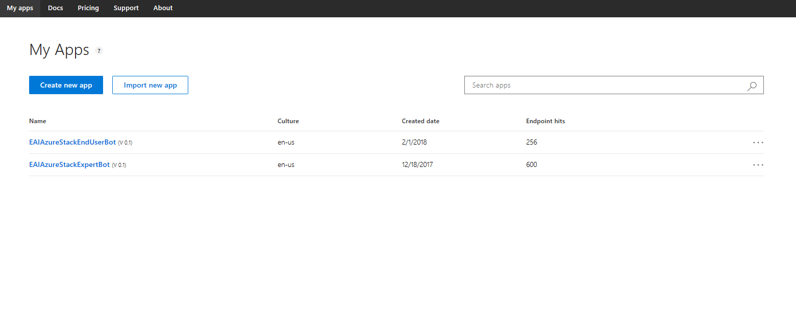

4. Select the Review Endpoint utterances option
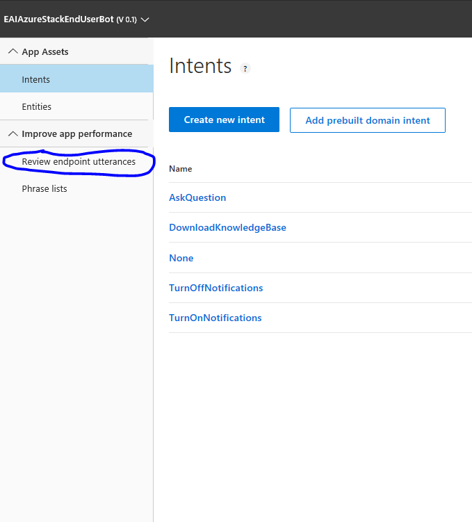

	1. Select the aligned intent that best suits each utterance
	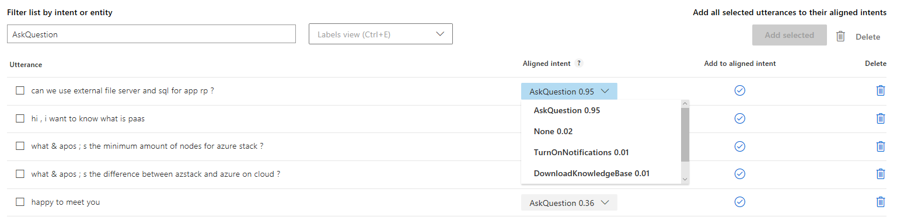

	2. Identify the entities present in the utterance (if any).
		1. To do so, left click on the first word and then on the last word of the entity and select the entity type
		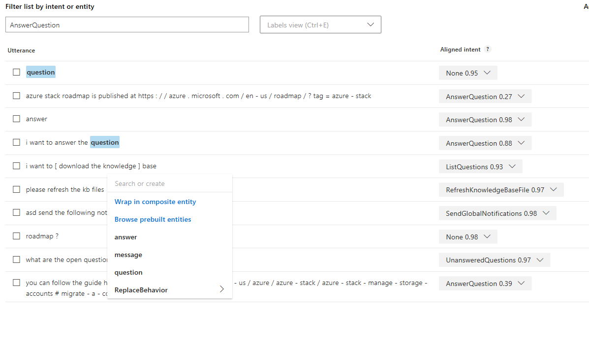

	3. Click on the check button (Add to aligned intent)
	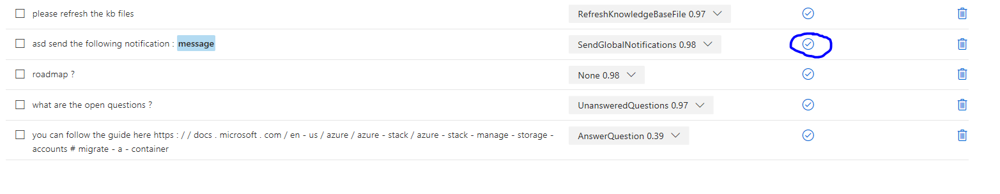

5. After setting the intents and/or the entities train the model (the training will ensure that the new utterances are taken into account);
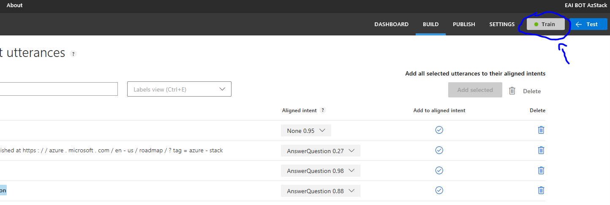

6. Publish the newly trained model (the changes made to the model are only effective once the model is publish)
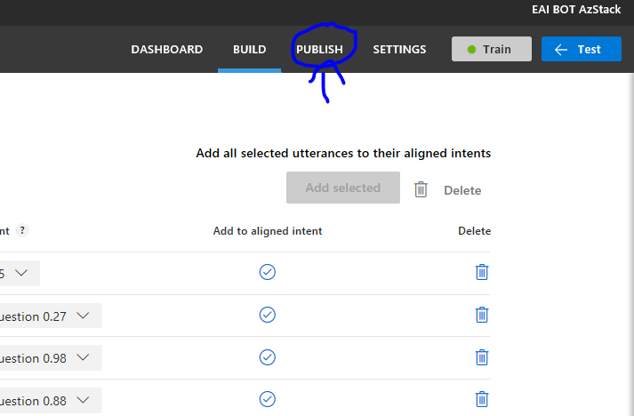
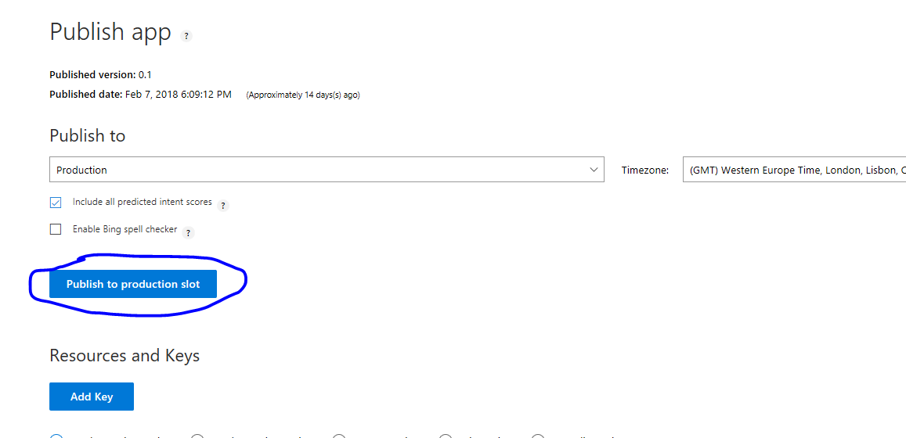

## KNOWLEDGE BASE TRAINING
To edit the knowledge base go through the following steps:

1. Go to [www.qnamaker.ai](http://www.qnamaker.ai)

2. Sign in with the bot's credentials - eaibot@outlook.com

3. Select the service that holds the Knowledge Base
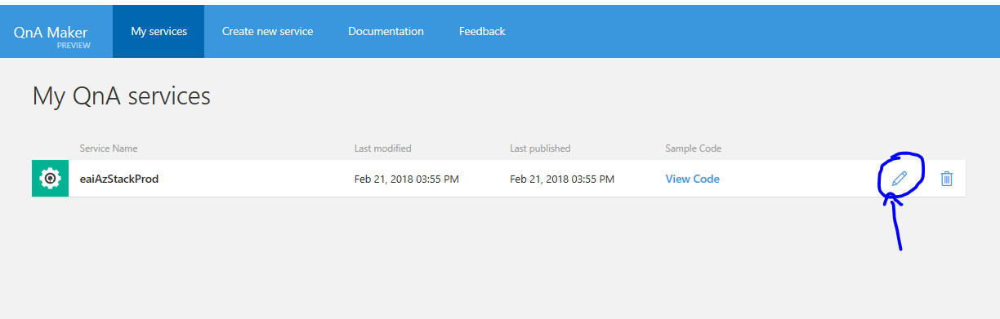

4. On this screen you can edit an answer, edit a question, add alternative phrasings, delete a QnA Pair or add a new pair (user the + Add new QnA Pair)
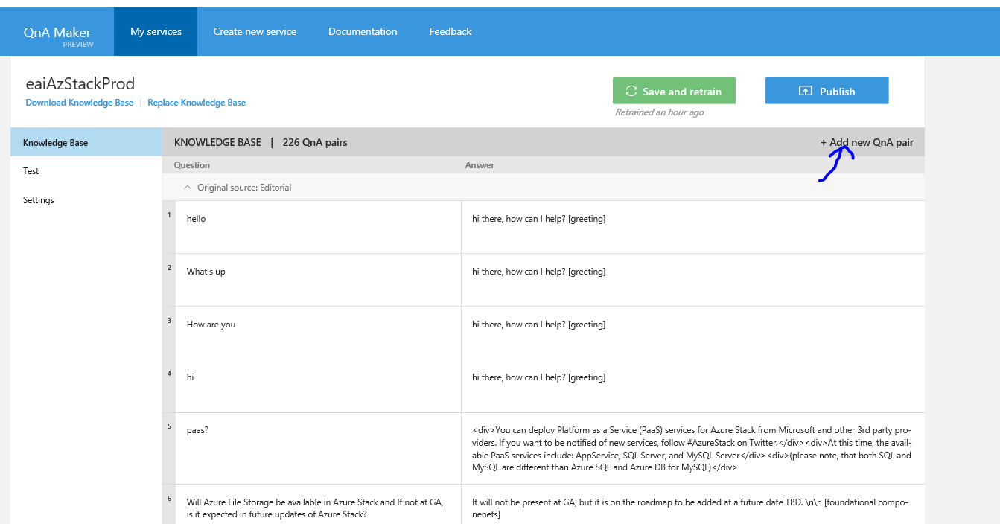

5. After editing the Knowledge Base click on Save and Retrain.
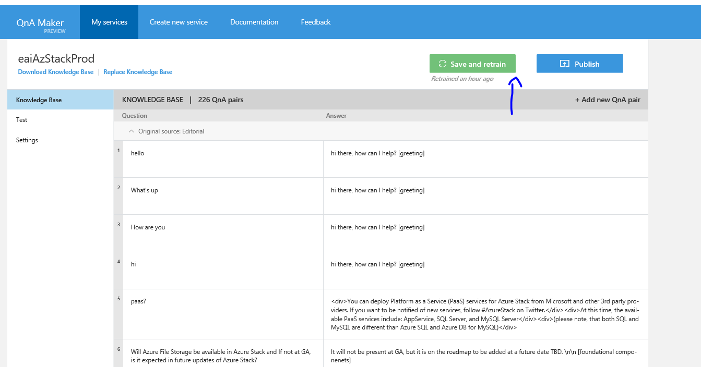

6. After the training finishes, publish the updated Knowledge Base
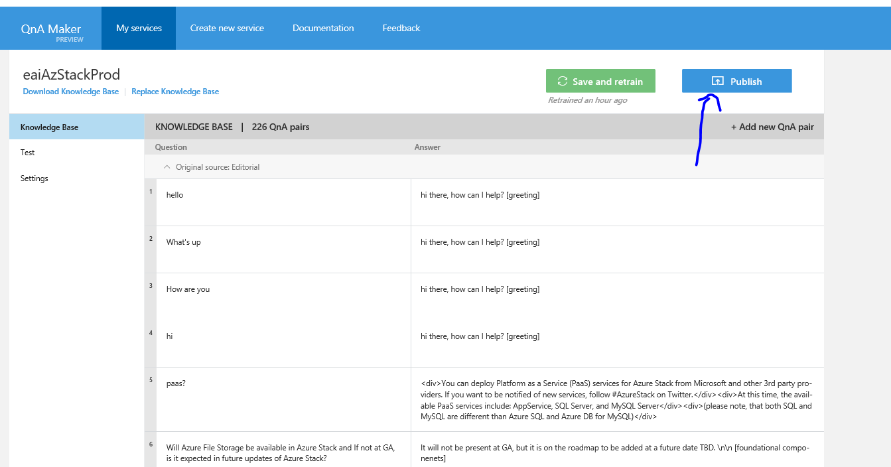
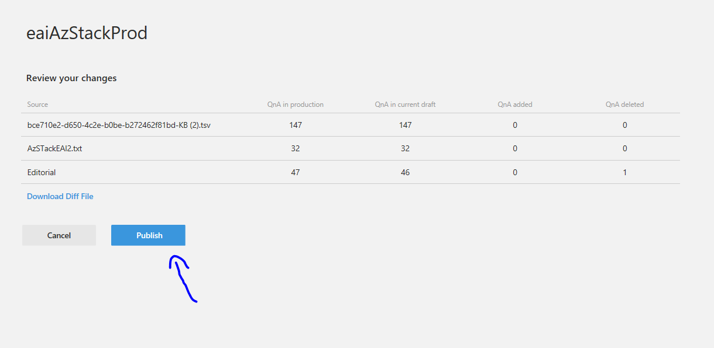

This project has adopted the [Microsoft Open Source Code of Conduct](https://opensource.microsoft.com/codeofconduct/). For more information see the [Code of Conduct FAQ](https://opensource.microsoft.com/codeofconduct/faq/) or contact [opencode@microsoft.com](mailto:opencode@microsoft.com) with any additional questions or comments.